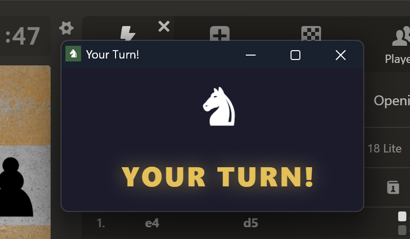

# Chess Turn Reminder

A Chrome extension that pops up an alert **only when it's your turn** on [chess.com](https://www.chess.com), so you never forget a running game.

## Features

- Detects your turn automatically — no manual timers
- Opens a persistent floating popup that stays on screen until you move
- Plays a short sound to grab your attention
- Popup refocuses itself if you click elsewhere in Chrome
- Remembers the position you dragged it to between turns

## How it works

A content script watches the chess.com game page using a `MutationObserver`. When the active clock switches to your side (`.clock-bottom.clock-player-turn`), it notifies the background service worker, which opens a small popup window. The popup stays visible until your opponent moves, then closes automatically.

## Installation

1. Clone or download this repo
2. Go to `chrome://extensions`
3. Enable **Developer mode** (top-right toggle)
4. Click **Load unpacked** and select the repo folder

## Supported sites

- chess.com — live games and daily (correspondence) games

## Files

| File | Purpose |
|---|---|
| `manifest.json` | Extension manifest (MV3) |
| `content.js` | Detects whose turn it is on chess.com |
| `background.js` | Opens/closes the alert popup window |
| `alert.html` | The popup UI with animation and sound |
