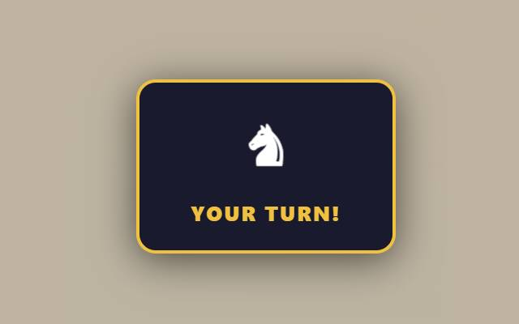
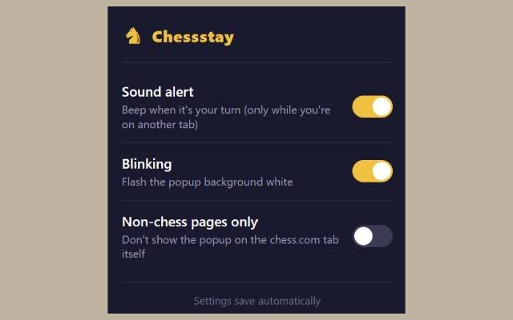

# Chessstay - Chess Turn Reminder

A Chrome extension that shows a reminder **only when it's your turn** on [chess.com](https://www.chess.com), so you never forget a running game — even when you've wandered off to another tab.

## Features

- **Automatic turn detection** — no manual timers; it watches the live game page
- **Follows you everywhere** — the reminder appears on whatever tab you're currently looking at, across all Chrome windows
- **Stays until you move** — a persistent floating popup that won't disappear when you click around
- **Doesn't steal focus** — it's an in-page overlay, so you can keep typing without interruption
- **Draggable with position memory** — drag it anywhere; it reappears in the same spot every turn
- **Works on local files too** — `file://` pages are supported (enable *Allow access to file URLs* for the extension)
- **Configurable** — click the toolbar icon for a settings popup

## Settings

Click the extension icon to open the settings popup:

| Setting | Default | What it does |
|---|---|---|
| **Sound alert** | Off | Beeps when your turn starts — but only while you're on another tab, never while you're looking at the chess page |
| **Blinking** | On | Flashes the popup background white to grab attention |
| **Non-chess pages only** | Off | Hides the popup on the chess.com tab itself, while still showing it on every other tab |

Settings save automatically and apply instantly.

## How it works

A content script watches the chess.com game page with a `MutationObserver`. When the active clock switches to your side (`.clock-bottom.clock-player-turn`, the page title, or a `your-turn` class), it shows an overlay on the page and notifies the background service worker. The service worker then injects a matching overlay into whatever tab you're currently viewing, and moves it as you switch tabs or windows. Everything disappears the moment your opponent moves or the game tab closes.

## Installation

1. Clone or download this repo
2. Go to `chrome://extensions`
3. Enable **Developer mode** (top-right toggle)
4. Click **Load unpacked** and select the repo folder
5. (Optional) Enable **Allow access to file URLs** on the extension's details page if you want the reminder on local `file://` pages

> Note: Chrome forbids all extensions from running on `chrome://` pages (Settings, Extensions, New Tab, etc.), so the reminder can't appear there. It will show up as soon as you switch to any normal tab.

## Supported sites

- chess.com — live games and daily (correspondence) games

## Files

| File | Purpose |
|---|---|
| `manifest.json` | Extension manifest (MV3) |
| `content.js` | Detects whose turn it is on chess.com and draws the in-page overlay |
| `background.js` | Service worker — tracks the active tab and injects/moves the overlay across tabs |
| `remote-overlay.js` | Overlay content script for non-chess tabs |
| `popup.html` / `popup.css` / `popup.js` | The settings popup shown when you click the toolbar icon |
